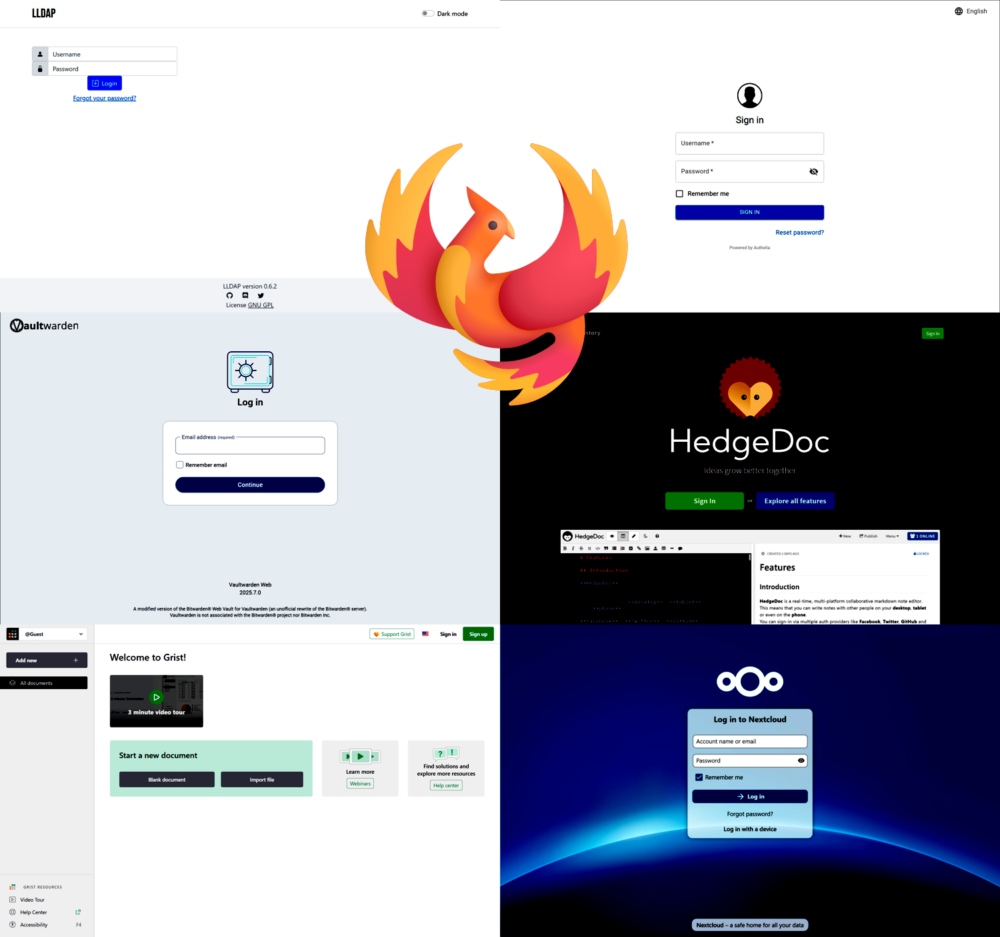

# Phoenix privacy architecture Linux implementation (beta)

*Privacy-forward alternative to Microsoft 365 / Google Workspace*

> [!WARNING]
> The initialization scripts presented herein are pre-release software and are presented as-is.

- Working early implementation of [Wild Blue](https://thewild.blue)'s *Phoenix* architecture, for standalone Linux hosts
- Phoenix is simple: Divide a computing environment into a variable-trust 'platform', where programs run, and secured 'crypts', where admin and user data are isolated
- **This implementation of Phoenix is a minimum-viable replacement for shared workspaces like Microsoft 365 or Google Workspace, making it perfect for first-time (or even experienced) self-hosters**
- Can be hosted on your own hardware, for maximum privacy, or in the cloud
- Optimized and well-tested, from ongoing use in production as [Wild Blue](https://thewild.blue)'s primary shared workspace
- **Platform**: Ubuntu 24.04 LTS for x86-64
- **Apps**: LDAP (user/group directory), auth (SSO), secrets, docs, sheets, DAV (contacts/calendars/tasks)
- **Feature set**: Base features (crypts, reverse proxy, central database, Docker, apps) + service features (metric exporters, app health checks, backups, TLS cert management, app updates)
- **Version**: Beta / internal MVP
- **Implementation languages**: Bash, SQL
- **License**: AGPLv3
- **Tested on**:
  - Ubuntu 24.04 LTS on various x86-64 VPS instances, having at least 2 vCPUs (with AES-NI) @ 2 GHz / 2G RAM / 20G SSD 
  - Ubuntu 24.04 LTS on WSL on x86-64 Windows 11 (platform init + restored crypts only)
  - Not tested on other distros or CPU architectures, though Debian should work with few modifications
  - Thanks to careful design:
    - Should function on more limited configurations, e.g. 1 CPU @ 1 GHz / 1G RAM / 10G SSD (x86-64 RPi equivalent?)
    - Vertically scaling the host can solve many performance problems (significant headroom between the minimum and other configurations)
- **Note for enthusiasts**: Enough configuration is exposed here to distribute apps between multiple hosts, offering an alternative scaling path and even supporting multiple instances of each app. However, this is left as an exercise for the reader.

## Features

- 🪣 Isolation of admin and user data in 'crypts', encrypted folders that are easy to back up securely (and even move to other hosts)
- 🔒 Simple interface with crypts unmounted:
  - ⤴️ *Mount crypts*
- 🔓 Simple interface with crypts mounted:
  - ℹ️ *Get status*
  - ▶️ *Start*
  - ⏹️ *Stop*
  - 🔄️ *Update APT packages and reboot*
- 🔎 AES-NI detection (lack of AES-NI being the most common cause of poor performance)
- 🔀 Automatic internal port generation, unique to each instance and divided between platform ports (low port numbers) and crypt ports (high port numbers, for services operating on admin/user data)
- 📨 Auto-configured SMTP client, with support for logging sensitive transfers to the admin crypt
- 📘 Automatic configuration of JournalD, to support resource-constrained hosts
- 🗃️ Automatic swap file creation/management, to support resource-constrained hosts
- 📈 Auto-configured Prometheus metric exporters
- 🌐 Auto-configured, shared Nginx reverse proxy, to handle incoming app traffic
- 🦭 Auto-configured, shared MariaDB, to manage tabular data for apps
- 🐳 Auto-configured, shared Docker Engine, to manage app execution and persistent storage
- 👥 Automatic provisioning of admin and service users
- 🤫 Automatic generation of admin and service user secrets
- 🤒 Automatic app health checks
- ☁️ Automatic daily backup to Backblaze (encrypted)
- 🗝️ Automatic issuance and renewal of TLS certificates
- 🔄️ Automatic app updates

### Apps

All apps are containers composed from community-maintained images of popular open source projects. **All apps have web interfaces, as seen above, in addition to their other features.**

- 📇 LDAP, based on [LLDAP](https://github.com/lldap/lldap) 
  - Lightweight user and group directory

- 🤝 Auth, based on [Authelia](https://github.com/authelia/authelia) 
  - Simple, performant, and compliant OIDC provider

- 🔒 Secrets, based on [Vaultwarden](https://github.com/dani-garcia/vaultwarden) 
  - Lightweight and cryptographically sound secrets management
  - Compatible with Bitwarden clients

- 📝 Docs, based on [HedgeDoc](https://github.com/hedgedoc/hedgedoc) 
  - Simple and featureful Markdown document editor
  - Collaborative editing
  - [Automatic compression of image uploads](https://github.com/tiny-media/hedgedoc-image-compressor)

- 🧮 Sheets, based on [Grist](https://github.com/gristlabs/grist-core) 
  - Alternative to Google Sheets and Airtable
  - Sheet format is based on SQLite and can be easily downloaded/opened on any platform

- 📅 DAV, based on [Nextcloud](https://github.com/nextcloud/server) 
  - Management of contacts, calendars, and tasks
  - Compatible with iOS and Android (the latter requires a third-party app)

## Installation

- Copy `platform-admin` in this repository to `/home/ubuntu` on the host
- `cd /home/ubuntu/platform-admin/init-phoenix/config && cp config.sh.example config.sh` and complete to-dos in `config.sh`
- `cp config.aas.sh.example config.aas.sh` and complete to-dos in `config.aas.sh`
- Run platform init: `cd .. && . init-phoenix.aas.sh`
- If successful, mount crypts: `cd .. && phx.aas.mount-crypts.sh`
- Copy `crypt-admin` in this repository to `/home/ubuntu/crypt` on the host
- `cd /home/ubuntu/crypt/crypt-admin/init-phoenix/config && cp config.sh.example config.sh` and complete to-dos in `config.sh` (lengthy but mostly for SMTP)
- `cp config.aas.sh.example config.aas.sh` and complete to-dos in `config.aas.sh`
- Run crypt init: `cd .. && . init-phoenix.aas.sh`
- `cd .. && phx.aas.start.sh`
- **Move** the following variables in `/home/ubuntu/crypt/crypt-admin/init-phoenix/state/state.sh` to a password/secrets manager:
  - `PHX_MARIA_DB_ROOT_DB_PASSWORD`
  - `PHX_SECRETS_VAULTWARDEN_ADMIN_TOKEN`
- **Record** the following variables in `/home/ubuntu/crypt/crypt-admin/init-phoenix/state/state.sh` in a password/secrets manager:
  - `PHX_LDAP_LLDAP_USER_PASS` (LDAP admin password)
  - `PHX_DAV_NEXTCLOUD_LDAP_PASSWORD`
  - `PHX_DAV_NEXTCLOUD_ADMIN_PASSWORD`
- In a web browser, go to https://`$PHX_LDAP_DOMAIN`, login as `ldap-admin` with `$PHX_LDAP_LLDAP_USER_PASS`, create the user `$PHX_APP_SUPER_USER_ID` (with e-mail `$PHX_APP_SUPER_USER_EMAIL`) and the `authorized-users` group, and make `$PHX_APP_SUPER_USER_ID` an authorized user
- In a web browser, go to https://`$PHX_SECRETS_DOMAIN`/admin, login with `$PHX_SECRETS_VAULTWARDEN_ADMIN_TOKEN`, invite `$PHX_APP_SUPER_USER_EMAIL`, and create the first organization
- In a web browser, go to https://`$PHX_SHEETS_DOMAIN`, login as `$PHX_APP_SUPER_USER_ID`, and create the first organization
- In a web browser, go to https://`$PHX_DAV_DOMAIN`, login as `dav-admin` with `$PHX_DAV_NEXTCLOUD_ADMIN_PASSWORD`, and finish its config via GUI (instructions below)

### Manual DAV/Nextcloud configuration (ugh)

> I have a love-hate relationship with Nextcloud.

- Disable non-essential apps
  - `activity`
  - `app_api`
  - `systemtags`
  - `comments`
  - `contactsinteraction`
  - `dashboard`
  - `encryption`
  - `files_external`
  - `federation`
  - `files_reminders`
  - `firstrunwizard`
  - `nextcloud_announcements`
  - `webhook_listeners`
  - `notifications`
  - `files_pdfviewer`
  - `password_policy`
  - `photos`
  - `recommendations`
  - `related_resources`
  - `support`
  - `circles`
  - `text`
  - `twofactor_nextcloud_notification`
  - `updatenotification`
  - `survey_client`
  - `user_status`
  - `weather_status`
- Enable: Auditing / Logging, LDAP user and group backend, Suspicious Login, Two-Factor TOTP Provider
- Download: Calendar, Contacts, Tasks, Two-Factor WebAuthn
- User (and admin) storage quota to 1 GB
- Basic: Disable profiles (and admin's in 'Personal Settings'), enforce Win file name compat, calendar invites via system SMTP
- Sharing API:
  - Uncheck 'Allow resharing'
  - Toggle off:
    - 'Allow users to share via link and emails'
    - 'Allow account name autocompletion in share dialog and allow access to the system address book'
    - 'Allow autocompletion when entering the full name or email address (ignoring missing phonebook match and being in the same group)'
- Sharing: Disable reshare default permission, disable federated options
- Security: Enforce 2FA except DAV admin
- LDAP
  - Source: https://github.com/lldap/lldap/blob/main/example_configs/nextcloud.md
  - Default URL: `ldap://172.17.0.1`
  - Default port: `$PHX_LDAP_LDAP_PORT`
  - Default user: `uid=app-dav-nextcloud,ou=people,$PHX_LDAP_LLDAP_BASE_DN`
  - Default users query (auto-gen): `person` object class, authorized users group
  - Default login query (manual): `(&(objectclass=person)(|(uid=%uid)(mail=%uid)))`
  - Default groups query (auto-gen): `groupOfUniqueNames` object class, authorized users group
  - Default cache TTL (advanced): 60 seconds
  - Default internal username attribute (expert config): `user_id`
- Per user (optional)
  - Lock profile values (local only)
  - Don't show system contacts
  - Don't show tasks in calendar

---

- Move log / audit log locations (can bloat backups)
  - `sudo vi /root/docker-vol-crypt/dav_config/config.php`
  - Add entry `'logfile' => '/var/www/data/nextcloud.log'`
  - Add entry `'logfile_audit' => '/var/www/data/audit.log'`

## Why are you giving this away?

I designed and built this because I care about controlling my data and don't trust cloud providers. At a certain point, as a 'failed' startup owner, I could no longer afford my cloud bills or the risk (and corresponding maintenance burden) of keeping basic services on-prem. This was my solution, which I find too useful to keep to myself, but too immature (at the moment) to productize.

Mostly, though, I'm trying to re-establish some credibility after building a limited-release, proprietary product over several years. If it worked, please go [here](https://about.thewild.blue/jess).

@wildblueguy

©2025 Wild Blue Ventures Inc.